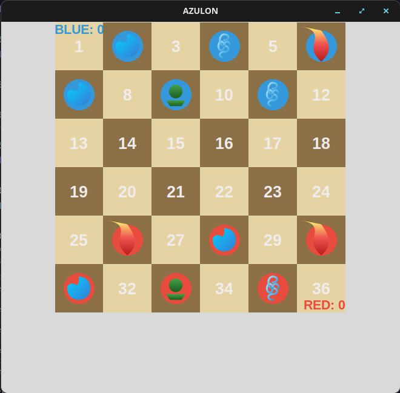
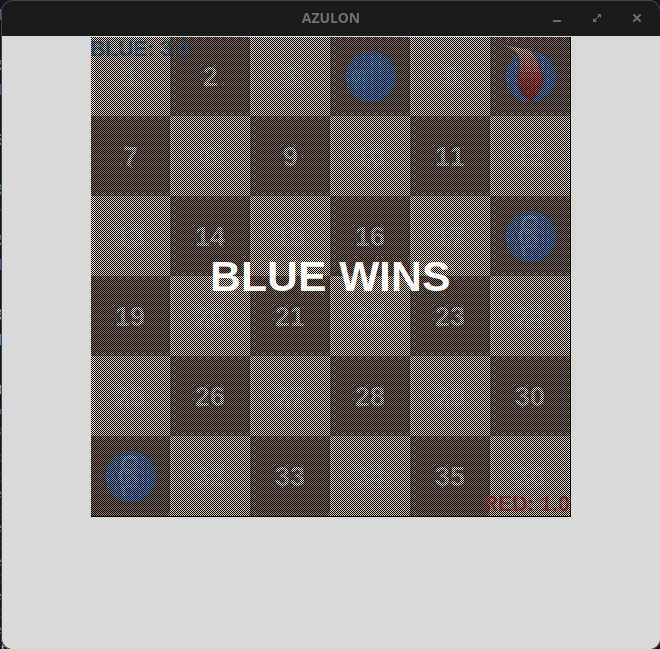

# Azulon MN — Avatar-themed Checkers (6x6) with Minimax (Tkinter)

## Overview (the problem)
This project implements an **Avatar: The Last Airbender** themed **checkers (draughts)** game focused on demonstrating **game AI decision-making** using the **Minimax** algorithm.

This is a smaller custom variant of the original game:
- Board size is **6x6** (instead of 8x8).
- Each player starts with **6 pieces** (instead of 12).
- Only **one capture per turn** is allowed.
- The winner is the player with the **highest accumulated score**.

The game includes element-themed pieces (Water/Earth/Fire/Air). Each element has a weight that impacts the scoring/heuristic used by Minimax.

## Rules (custom checkers variant)
### Board and pieces
- The game is played on a **6x6** board.
- Each player has **6 pieces**.
- Pieces represent the elements **Water, Earth, Fire, Air**.

### Captures
- You can capture **only one opponent piece per turn** (no multi-capture chain in the same move).

### Scoring and winning
- The match is decided by **points**, not necessarily by eliminating all opponent pieces.
- The winner is the player who finishes with the **highest accumulated score**.

## Tech stack
- **Python**
- **Tkinter** for the GUI
- **Minimax** for the AI opponent

## Dependencies (from `requirements.txt`)
This project uses third-party Python libraries listed in `requirements.txt`.

> Paste your `requirements.txt` here and replace this section with the exact list and a short note about what each library is used for.

## Project organization
The project is organized by responsibility to keep rules, UI theme, and gameplay logic separated:

- `theme/`
  UI-related code and styling resources (only colors).

- `domain/`
  Core domain layer (pure game concepts): pieces, elements, board representation, rules, scoring, and other entities/value objects.
  Ideally, this layer should have minimal dependency on UI details.

- `game/`
  Gameplay orchestration: match flow, player turns, applying moves, integrating Minimax, and connecting the `domain/` rules to the UI.

- `assets/`
  Static files such as images, icons, and screenshots used by the UI and by the README.
  Suggested structure:
  - `assets/screenshots/`
  - `assets/svg/`

## Project images
Add screenshots and other images to `assets/` and reference them in the README:

```md


```

## Requirements
- **Python 3.09+** (recommended)
- Windows / Linux / macOS

## Setup & Run (venv)

### 1) Clone
```bash
git clone https://github.com/FlavioInacio-jf/azulon-mn.git
cd azulon-mn
```

### 2) Create and activate a virtual environment
#### Linux/macOS
```bash
python3 -m venv .venv
source .venv/bin/activate
```

#### Windows (PowerShell)
```powershell
python -m venv .venv
.\.venv\Scripts\Activate.ps1
```

#### Linux (Terminal)
```powershell
python -m venv .venv
source venv/bin/activate
```

### 3) Install dependencies
```bash
pip install -r requirements.txt
```

### 4) Configure element weights (optional but recommended)
You can configure element weights via environment variables (values from **0.0 to 1.0**).

1. Copy:
```bash
cp .env.example .env
```

2. Edit `.env` and set:
- `WATER_WEIGHT`
- `EARTH_WEIGHT`
- `FIRE_WEIGHT`
- `AIR_WEIGHT`
- `MINIMAX_DEPTH`

Higher values mean that element is considered more valuable by the evaluation heuristic used in Minimax.

> Note: `.env` is meant to be local-only and should not be committed.

### 5) Tkinter / Tk setup (important)
Because the GUI uses **Tkinter**, your machine must have **Tk** support installed.

#### Windows
- Tkinter usually comes bundled with the standard Python installer from python.org.
- If you get errors like `ModuleNotFoundError: No module named '_tkinter'`, reinstall Python and ensure the optional **tcl/tk** component is enabled.

#### Ubuntu/Debian Linux
```bash
sudo apt-get update
sudo apt-get install python3-tk
```

#### Fedora
```bash
sudo dnf install python3-tkinter
```

#### Arch
```bash
sudo pacman -S tk
```

#### macOS
- Python from python.org typically includes Tk.
- If you use Homebrew Python and Tkinter fails, you may need `brew install tcl-tk` and to ensure Python is linked against it (depends on your setup).

### 6) Run
Run the project using your actual entry point. Examples:
- If the entry file is `main.py`:
```bash
python main.py
```
- If it’s `src/main.py`:
```bash
python src/main.py
```

## How the AI works (Minimax)
The AI searches future moves by building a decision tree:
- Alternates between **maximizing** (AI) and **minimizing** (opponent).
- States are scored using an evaluation function that incorporates the **element weights**.
- Greater depth usually improves play quality but increases computation time.